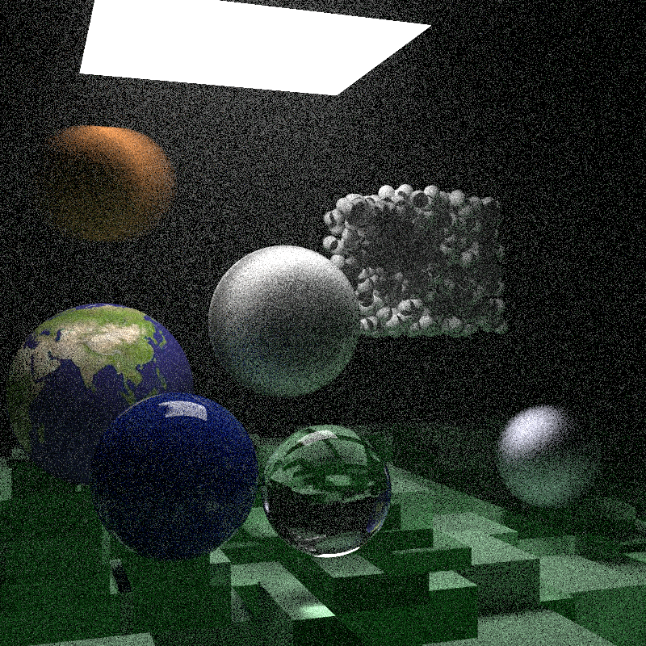

# RayTracing-TheRestOfYourLife
[Ray Tracing: The Rest of Your Life](https://raytracing.github.io/books/RayTracingTheRestOfYourLife.html)([日本語版](https://inzkyk.xyz/ray_tracing_in_one_weekend/))を学んでいる記録。[レイトレ三部作のgithubリンク](https://github.com/RayTracing/raytracing.github.io)

wip:

---

# メモ

## MCでπを求める
動かし続けるタイプでは3.1415まで収束。次の桁は収束する前にオーバーフロー

## MCでπ、層化サンプリング
Regular    Estimate of Pi = 3.141514800000

Stratified Estimate of Pi = 3.141589480000

## x^2, [0,2)の積分値推定
実際は  8/3 ≒ 2.6666666666667

MC法は  I = 2.666462964444

## サンプリングに偏りを持たせる
日本語pdf資料の方がちょっと良いコードになっている。ゼロ除算の回避を入れている

0から2にむけて線形に増加するサンプリングを考えたときの結果は

I = 2.666772599164

一様サンプリングより若干近い値が得られた？

## 正確に追従させることができる(重点サンプリング)
$x^2, x\in [0,2)$に合わせたい。この場合は以下の手順で求める。

1. $p(r) = C r^2$, Cは定数。
2. 確率の合計は1。$\int_0^2 p(r) dr = \int_0^2 C r^2 dr = C\cdot 8/3$が1。つまり$C = 3/8$
3. 確率密度関数pdf $p(r)$ から累積分布関数CDF $P(x)$ を求める。0--2の範囲では$\int_0^x p(r) dr = \int_0^x 3r^2/8 dr = x^3/8$
4. CDFの逆関数から、サンプリングの式を決定する。$P^{-1}(x) = 8x^{1/3}$

*正確なpdfなら1サンプルで十分*　←なんかかっこいい

正確に逆関数が求まるなら1サンプルで積分結果がバッチリ得られる。正確に逆関数が求まらない場合でも、それに近い関数を使えば比較的収束の速い積分結果が得られる。重点サンプリング便利。